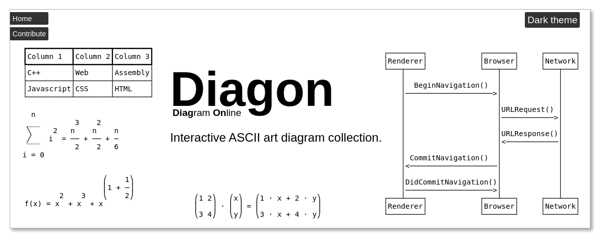

# Diagon

[](https://arthursonzogni.com/Diagon/)

Diagon is an interactive interpreter. It transforms markdown-style expression
into an ascii-art representation.

It is written in C++ and use WebAssembly, HTML and CSS to make a Web
Application.
We also expose a command line interface, for personal and 3rd party tools.

# Web application

[https://arthursonzogni.com/Diagon/](https://arthursonzogni.com/Diagon/)

# Command line interface

Diagon is also usable as a command line tool.
For instance:
```bash
echo "1+1/2 + sum(i,0,10) = 112/2" | diagon Math
            10         
          ___        
      1   ╲       112
  1 + ─ + ╱   i = ───
      2   ‾‾‾      2 
           0         
```
To use it, you can either compile it from source or use the precompiled binaries published on the snapstore:
~~~bash
sudo snap install diagon
~~~
[](https://snapcraft.io/diagon)
[](https://snapcraft.io/diagon) 

# IDE plugins

Make diagon easy to use inside your IDE. Thanks to contributors:
- [vim-diagon](https://github.com/willchao612/vim-diagon)
- [vscode-diagon](https://github.com/ElmouradiAmine/vscode-diagon)

### [https://arthursonzogni.com/Diagon/](https://arthursonzogni.com/Diagon/)

**Table of content**
 * [Diagon](#diagon)
 * [Generators](#generators)
 * [Command line interface](#command-line-interface)
 * [Download packages](#download-packages)
 * [Build](#build)
 * [Thanks](#thanks)

# Generators

<details>
   <summary>Mathematic Expression</summary>

input:
~~~
f(x) = 1 + x / (1 + x)
~~~

output (Unicode):
~~~
             x  
f(x) = 1 + ─────
           1 + x
~~~

input:
~~~
sqrt(1+sqrt(1+x/2))
~~~

output (Unicode)
~~~
     _____________
    ╱        _____
   ╱        ╱    x
  ╱  1 +   ╱ 1 + ─
╲╱       ╲╱      2
~~~

input:
~~~
f(x) = 1 + x^2 + x^3 + x^(1+1/2)
~~~

output (Unicode):
~~~
                      ⎛    1⎞
                      ⎜1 + ─⎟
            2    3    ⎝    2⎠
f(x) = 1 + x  + x  + x       
~~~

input:
~~~
sum(i^2,i=0,n) = n^3/2+n^2/2+n/6
~~~

output (Unicode):
~~~
  n                   
 ___        3    2    
 ╲     2   n    n    n
 ╱    i  = ── + ── + ─
 ‾‾‾        2    2   6
i = 0                 
~~~

input:
~~~
int(x^2/2 * dx ,0,1) = 1/6
~~~

output (Unicode):
~~~
1            
⌠  2         
⎮ x         1
⎮ ── ⋅ dx = ─
⌡  2        6
0            
~~~

input:
~~~
[a;b] + [c;d] = [a+c; b+d]
~~~

output (Unicode):
~~~
⎛a⎞   ⎛c⎞   ⎛a + c⎞
⎜ ⎟ + ⎜ ⎟ = ⎜     ⎟
⎝b⎠   ⎝d⎠   ⎝b + d⎠
~~~

input:
~~~
[1,2;3,4] * [x;y] = [1*x+2*y; 3*x+4*y]
~~~

~~~
⎛1 2⎞   ⎛x⎞   ⎛1 ⋅ x + 2 ⋅ y⎞
⎜   ⎟ ⋅ ⎜ ⎟ = ⎜             ⎟
⎝3 4⎠   ⎝y⎠   ⎝3 ⋅ x + 4 ⋅ y⎠
~~~

</details>

<details>
   <summary> Sequence Diagram </summary>

## Sequence Diagram

input
~~~
Alice -> Bob: Hello Bob!
Alice <- Bob: Hello Alice!
~~~

Output (Unicode)
~~~
┌─────┐       ┌───┐
│Alice│       │Bob│
└──┬──┘       └─┬─┘
   │            │  
   │ Hello Bob! │  
   │───────────>│  
   │            │  
   │Hello Alice!│  
   │<───────────│  
┌──┴──┐       ┌─┴─┐
│Alice│       │Bob│
└─────┘       └───┘
~~~

Input
~~~
Renderer -> Browser: BeginNavigation()
Browser -> Network: URLRequest()
Browser <- Network: URLResponse()
Renderer <- Browser: CommitNavigation()
Renderer -> Browser: DidCommitNavigation()
~~~

Output (Unicode)
~~~
 ┌────────┐            ┌───────┐     ┌───────┐
 │Renderer│            │Browser│     │Network│
 └───┬────┘            └───┬───┘     └───┬───┘
     │                     │             │    
     │  BeginNavigation()  │             │    
     │────────────────────>│             │    
     │                     │             │    
     │                     │URLRequest() │    
     │                     │────────────>│    
     │                     │             │    
     │                     │URLResponse()│    
     │                     │<────────────│    
     │                     │             │    
     │ CommitNavigation()  │             │    
     │<────────────────────│             │    
     │                     │             │    
     │DidCommitNavigation()│             │    
     │────────────────────>│             │    
 ┌───┴────┐            ┌───┴───┐     ┌───┴───┐
 │Renderer│            │Browser│     │Network│
 └────────┘            └───────┘     └───────┘
~~~


Input
~~~
1) Renderer -> Browser: Message 1
2) Renderer <- Browser: Message 2

Renderer: 1<2
Browser: 2<1
~~~

Output (Unicode)
~~~
 ┌────────┐┌───────┐
 │Renderer││Browser│
 └───┬────┘└───┬───┘
     │         │    
     │──┐      │    
     │Message 2│    
     │<────────│    
     │  │      │    
     │Message 1│    
     │  └─────>│    
 ┌───┴────┐┌───┴───┐
 │Renderer││Browser│
 └────────┘└───────┘
~~~
   
</details>
   
<details>
   <summary>Tree</summary>

Input
~~~
Linux
  Android
  Debian
    Ubuntu
      Lubuntu
      Kubuntu
      Xubuntu
      Xubuntu
    Mint
  Centos
  Fedora
~~~

Output (Style Unicode 1)
~~~
Linux
 ├─Android
 ├─Debian
 │  ├─Ubuntu
 │  │  ├─Lubuntu
 │  │  ├─Kubuntu
 │  │  ├─Xubuntu
 │  │  └─Xubuntu
 │  └─Mint
 ├─Centos
 └─Fedora
~~~

Output (Style ASCII 2)
~~~
Linux
 +--Android
 +--Debian
 |   +--Ubuntu
 |   |   +--Lubuntu
 |   |   +--Kubuntu
 |   |   +--Xubuntu
 |   |   `--Xubuntu
 |   `--Mint
 +--Centos
 `--Fedora
~~~

Output (Style Unicode right top)
~~~
───Linux─┬─Android
         ├─Debian─┬─Ubuntu─┬─Lubuntu
         │        │        ├─Kubuntu
         │        │        ├─Xubuntu
         │        │        └─Xubuntu
         │        └─Mint
         ├─Centos
         └─Fedora
~~~

Output (Style Unicode right center)
~~~
         ┌─Android
         │                 ┌─Lubuntu
         │                 ├─Kubuntu
         ├─Debian─┬─Ubuntu─┼─Xubuntu
───Linux─┤        │        └─Xubuntu
         │        └─Mint
         ├─Centos
         └─Fedora
~~~

</details>
<details>
   <summary>Frame</summary>

Input
~~~
#include <iostream>
using namespace std;

int main() 
{
    cout << "Hello, World!";
    return 0;
}
~~~

Output
~~~
┌─┬────────────────────────────┐
│1│#include <iostream>         │
│2│using namespace std;        │
│3│                            │
│4│int main()                  │
│5│{                           │
│6│    cout << "Hello, World!";│
│7│    return 0;               │
│8│}                           │
└─┴────────────────────────────┘
~~~

</details>
<details>
   <summary>Table</summary>

Input
~~~
Column 1,Column 2,Column 3
C++,Web,Assembly
Javascript,CSS,HTML
~~~

Output (Style Unicode)
~~~
┌──────────┬────────┬────────┐
│Column 1  │Column 2│Column 3│
├──────────┼────────┼────────┤
│C++       │Web     │Assembly│
├──────────┼────────┼────────┤
│Javascript│CSS     │HTML    │
└──────────┴────────┴────────┘
~~~

</details>

<details>
   <summary>GraphPlanar</summary>

Input
~~~
if -> "then A" -> end
if -> "then B" -> end
end -> loop -> if
~~~

Output (Unicode)
~~~
┌──────────┐     
│    if    │     
└△─┬──────┬┘     
 │ │     ┌▽─────┐
 │ │     │then A│
 │ │     └┬─────┘
 │┌▽─────┐│      
 ││then B││      
 │└┬─────┘│      
 │┌▽──────▽─┐    
 ││   end   │    
 │└┬────────┘    
┌┴─▽─┐           
│loop│           
└────┘           
~~~
   
</details>
   
<details>
   <summary>GraphDAG</summary>

Input:
```
socks -> shoes    
underwear -> shoes
underwear -> pants
pants -> shoes    
pants -> belt     
belt -> jacket    
shirt -> belt     
shirt -> tie      
tie -> jacket     
```

Output:
```
┌─────┐┌─────────┐┌─────┐     
│socks││underwear││shirt│     
└┬────┘└┬─┬──────┘└┬─┬──┘     
 │      │┌▽─────┐  │┌▽───────┐
 │      ││pants │  ││tie     │
 │      │└┬──┬──┘  │└┬───────┘
┌▽──────▽─▽┐┌▽─────▽┐│        
│shoes     ││belt   ││        
└──────────┘└┬──────┘│        
┌────────────▽───────▽┐       
│jacket               │       
└─────────────────────┘       
```
     
Input:
```
chrome -> content  
chrome -> blink    
chrome -> base     
                   
content -> blink   
content -> net     
content -> base    
                   
blink -> v8        
blink -> CC        
blink -> WTF       
blink -> skia      
blink -> base      
blink -> net       
                   
weblayer -> content
weblayer -> chrome 
weblayer -> base   
                   
net -> base        
WTF -> base        
```

Output
```
┌────────┐                     
│weblayer│                     
└┬─┬─┬───┘                     
 │ │┌▽────────────────────────┐
 │ ││chrome                   │
 │ │└┬─────┬─────────────────┬┘
 │┌▽─▽────┐│                 │ 
 ││content││                 │ 
 │└┬─┬─┬──┘│                 │ 
 │ │ │┌▽───▽──────────────┐  │ 
 │ │ ││blink              │  │ 
 │ │ │└┬──┬───┬─┬───┬───┬─┘  │ 
 │ │┌▽─▽┐┌▽──┐│┌▽─┐┌▽─┐┌▽───┐│ 
 │ ││net││WTF│││v8││CC││skia││ 
 │ │└┬──┘└┬──┘│└──┘└──┘└────┘│ 
┌▽─▽─▽────▽───▽──────────────▽┐
│base                         │
└─────────────────────────────┘
```

Input:
```
random -> pool_urbg              
random -> nonsecure_base         
random -> seed_sequence          
random -> distribution           
                                 
nonsecure_base -> pool_urbg      
nonsecure_base -> salted_seed_seq
                                 
seed_sequence -> pool_urbg       
seed_sequence -> salted_seed_seq 
seed_sequence -> seed_material   
                                 
distribution -> strings          
                                 
pool_urbg -> seed_material       
                                 
salted_seed_seq -> seed_material 
                                 
seed_material -> strings         
```

Output:
```
┌───────────────────────────────┐             
│random                         │             
└┬─────────────┬─────────────┬─┬┘             
┌▽───────────┐┌▽────────────┐│┌▽─────────────┐
│distribution││seed_sequence│││nonsecure_base│
└┬───────────┘└┬───┬───────┬┘│└┬┬────────────┘
 │             │  ┌│───────│─│─│┘             
 │ ┌───────────┘  ││       │ │┌┘              
 │ │┌─────────────▽▽┐┌─────▽─▽▽┐              
 │ ││salted_seed_seq││pool_urbg│              
 │ │└┬──────────────┘└┬────────┘              
 │┌▽─▽────────────────▽┐                      
 ││seed_material       │                      
 │└┬───────────────────┘                      
┌▽─▽────┐                                     
│strings│                                     
└───────┘                                     
```
   
</details>

<details>
   <summary>Flowchart</summary>

Input:
```
if ("DO YOU UNDERSTAND FLOW CHARTS?")                
  "GOOD!";                                           
else if ("OKAY, YOU SEE THE LINE LABELED 'YES'?") {  
  if ("... AND YOU CAN SEE THE ONES LABELED 'NO'?") {
    "GOOD";                                          
  } else {                                           
    if ("BUT YOU JUST FOLLOWED THEM TWICE?")         
      noop;                                          
    else                                             
      noop;                                          
    "(THAT WASN'T A QUESTION)";                      
    "SCREW IT"                                       
  }                                                  
} else {                                             
  if ("BUT YOU SEE THE ONES LABELED 'NO'?") {        
    return "WAIT, WHAT?";                            
  } else {                                           
    "LISTEN.";                                       
    return "I HATE YOU";                             
  }                                                  
}                                                    
                                                     
"LET'S GO DRING";                                    
"HEY, I SHOULD TRY INSTALLING FREEBSD!"              
```

Output:
```
   _________________                                                              
  ╱                 ╲                                                     ┌─────┐ 
 ╱ DO YOU UNDERSTAND ╲____________________________________________________│GOOD!│ 
 ╲ FLOW CHARTS?      ╱yes                                                 └──┬──┘ 
  ╲_________________╱                                                        │    
           │no                                                               │    
  _________▽_________                    ______________________              │    
 ╱                   ╲                  ╱                      ╲    ┌────┐   │    
╱ OKAY, YOU SEE THE   ╲________________╱ ... AND YOU CAN SEE    ╲___│GOOD│   │    
╲ LINE LABELED 'YES'? ╱yes             ╲ THE ONES LABELED 'NO'? ╱yes└──┬─┘   │    
 ╲___________________╱                  ╲______________________╱       │     │    
           │no                                     │no                 │     │    
   ________▽_________                     _________▽__________         │     │    
  ╱                  ╲    ┌───────────┐  ╱                    ╲        │     │    
 ╱ BUT YOU SEE THE    ╲___│WAIT, WHAT?│ ╱ BUT YOU JUST         ╲___    │     │    
 ╲ ONES LABELED 'NO'? ╱yes└───────────┘ ╲ FOLLOWED THEM TWICE? ╱yes│   │     │    
  ╲__________________╱                   ╲____________________╱    │   │     │    
           │no                                     │no             │   │     │    
       ┌───▽───┐                                   │               │   │     │    
       │LISTEN.│                                   └───────┬───────┘   │     │    
       └───┬───┘                                    ┌──────▽─────┐     │     │    
     ┌─────▽────┐                                   │(THAT WASN'T│     │     │    
     │I HATE YOU│                                   │A QUESTION) │     │     │    
     └──────────┘                                   └──────┬─────┘     │     │    
                                                      ┌────▽───┐       │     │    
                                                      │SCREW IT│       │     │    
                                                      └────┬───┘       │     │    
                                                           └─────┬─────┘     │    
                                                                 │           │    
                                                                 └─────┬─────┘    
                                                               ┌───────▽──────┐   
                                                               │LET'S GO DRING│   
                                                               └───────┬──────┘   
                                                             ┌─────────▽─────────┐
                                                             │HEY, I SHOULD TRY  │
                                                             │INSTALLING FREEBSD!│
                                                             └───────────────────┘
```


   
</details>

# Download packages

Binaries using multiple formats are provided in the [release](https://github.com/ArthurSonzogni/Diagon/releases) section.

# Build

This depends on cmake, uuid-dev and libboost-graph-dev
On Linux:
```sh
sudo apt install make uuid-dev libboost-graph-dev cmake default-jdk;
mkdir build;
cd build;
cmake .. -DCMAKE_BUILD_TYPE=Release
make -j
sudo make install 
```
            
# Thanks

This project has been possible thanks to these great projects
 * [ANTLR](http://www.antlr.org/)
 * [Boost-graph](https://www.boost.org/doc/libs/1_66_0/libs/graph/doc/)
 * [CMake](https://cmake.org/)
 * [Emscripten](https://github.com/kripken/emscripten)
 * [Git](https://git-scm.com/)
 * [KGT](https://github.com/katef/kgt)
 * [LLVM](https://llvm.org/)
 * [NeoVim](https://neovim.io/)
 * [PlantUML](http://plantuml.com/)
 * [WebAssembly](https://webassembly.org/)
